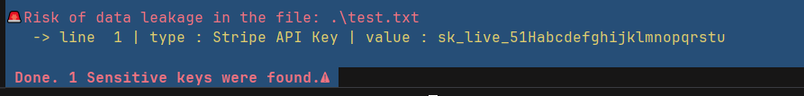

# 🛡️ API Secret Scanner


**API Secret Scanner** is a fast, lightweight, and colorful Command Line Interface (CLI) tool built with Python. It helps developers scan their source code directories to find hardcoded sensitive information (like AWS keys, Stripe tokens, and generic hex secrets) before they are accidentally committed to version control systems like GitHub.

---

## ✨ Features

- 🚀 **Fast Directory Scanning:** Quickly scans all files in a project, automatically skipping non-text files (e.g., images, PDFs) and common system directories (e.g., `.git`, `node_modules`, `.venv`).
- 🧠 **Regex-Based Detection:** Uses pre-defined Regex patterns to precisely identify:
  - Stripe API Keys
  - AWS Access Keys
  - Generic 32-character Hex Tokens
- 🎨 **Beautiful CLI Output:** Uses `Colorama` to provide a clear, color-coded terminal experience (Green for safe, Red for leaks).
- ⚙️ **Customizable Path:** Built with `argparse`, allowing you to scan any directory dynamically via terminal arguments.

---

## 📸 Screenshot

<!--  -->

---

## 🚀 Installation & Setup

1. **Clone the repository:**
   ```bash
   git clone [https://github.com/](https://github.com/)[erfandeve]/api-secret-scanner.git
   cd api-secret-scanner

# 2.Create a virtual environment (Recommended):

# Bash
python -m venv .venv
.\.venv\Scripts\activate  # On Windows
# source .venv/bin/activate  # On Linux/Mac


# 3.Install dependencies:
This project requires colorama for terminal colors.

# Bash
pip install colorama
💻 Usage
Run the scanner directly from your terminal.
Scan the current directory (Default):


# bash
python scanner.py
Scan a specific directory:
Use the -p or --path argument to define the target folder.

# Bash
python scanner.py -p "C:\Users\YourName\Desktop\TargetProject"


View Help Menu:
# Bash
python scanner.py --help


🛠️ How to Add Custom Rules?
You can easily add new rules to detect other types of tokens (like GitHub Tokens, Telegram Bot Tokens, etc.).
Just open scanner.py and add your Regex pattern to the PATTERNS dictionary:
# the PATTERNS 
PATTERNS = {
    "Stripe API Key": r"sk_live_[0-9a-zA-Z]{24}",
    "AWS Access Key": r"\b(AKIA|A3T...)[A-Z0-9]{16}\b",
    # Add your custom token here:
    "My Custom Token": r"your_regex_pattern_here"
}

# All rights reserved
# Programmed by Raminhimself
